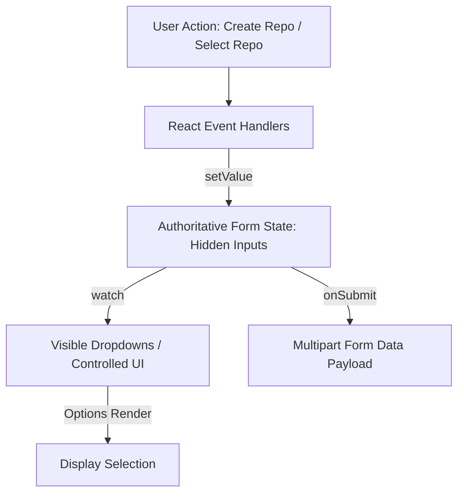
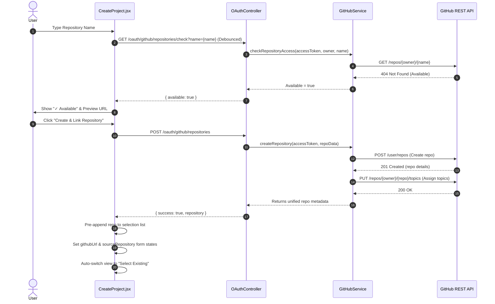
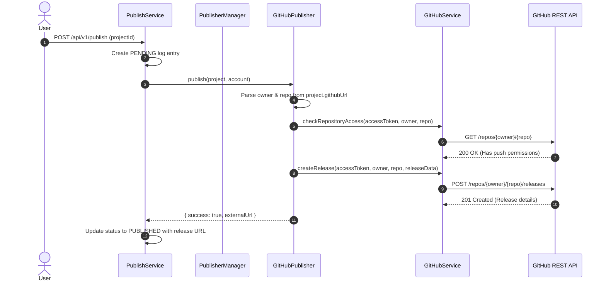

# Shift94 — Architecture Documentation

This document explains the system design blueprints, workflow sequences, and data binding architectures for the Shift94 repository creation and publishing flows.

---

## 1. Decoupled Form State Architecture

To prevent browser `<select>` elements from dropping or resetting values during state re-renders (due to asynchronous network options loading or DOM unmounting), the React forms use a decoupled hidden input architecture:

- **Hidden Inputs**: `<input type="hidden" name="githubUrl" />` and `<input type="hidden" name="sourceRepository" />` act as the authoritative single source of truth.
- **Controlled UI Dropdown**: Reads value from `watch('githubUrl')` and updates the authoritative inputs on select change. Option pre-appending in component state guarantees consistent state matching.

---

## 2. Repository Creation Workflow

When a user selects "Create New Repository" on the Create Project page, the following sequence occurs:

---

## 3. GitHub Release Publishing Workflow

Once the project is saved with `sourceRepository` metadata, publishing to GitHub triggers a Release creation:

