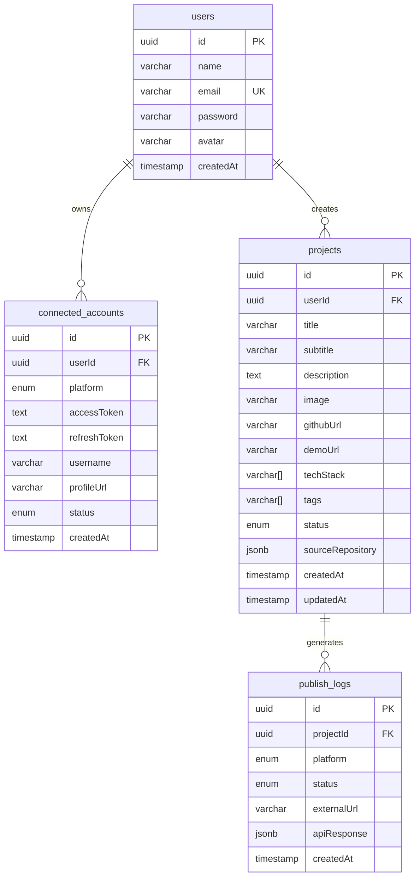

# Shift94 — Database Design

This document details the database schema, entity-relationship diagram, indexing strategies, and migration policies for Shift94.

## Entity-Relationship Diagram



## Normalization & Constraints
- **Third Normal Form (3NF)**: The schema is fully normalized. Non-key attributes depend solely on the primary keys. There are no transitive dependencies.
- **Referential Integrity**: Managed through foreign key constraints with `ON DELETE CASCADE` rules on all child tables to prevent orphaned records.
- **Uniqueness**: 
  - `users.email` is unique.
  - `connected_accounts.userId_platform` is unique (enforcing a maximum of one connection per platform per user).

## Indexing Strategy
- **`connected_accounts`**:
  - Index on `[userId]` for fetching connected platforms on dashboard load.
- **`projects`**:
  - Index on `[userId]` for listing a user's projects.
- **`publish_logs`**:
  - Index on `[projectId]` for fetching the logs of a specific project.
  - Index on `[createdAt DESC]` for chronological sorting on the History page.

## Migration Strategy
Shift94 uses **Prisma Migrations** to track database changes:
1. Ensure the PostgreSQL instance is running locally.
2. Configure `DATABASE_URL` in `backend/.env`.
3. Generate and apply migrations:
   ```bash
   cd backend
   npx prisma migrate dev --name init
   ```
4. Seed the database:
   ```bash
   npx prisma db seed
   ```
